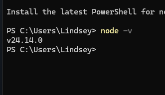
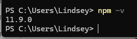
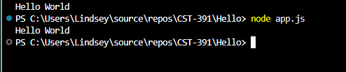
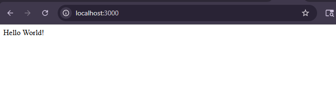
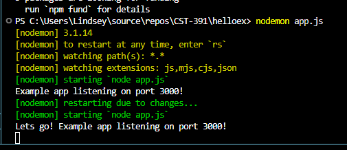
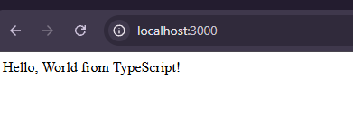
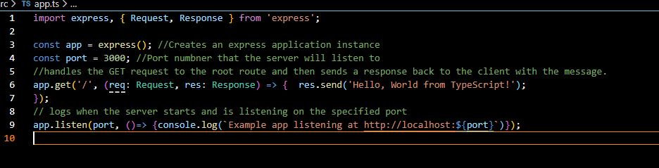

# CST391 - Activity 0: Tools Installation and Initial Applications - 
# Lindsey DeDecker
### March 4th, 2026

## Tool Installation and Understanding
In this activity I installed NodeJS and NPM. I then used NODEJS within Visual Studio Code.
Part 2 involved using TypeScript to create a node application. 

## Screenshots

- ### NodeJS installation
#### The below screenshot shows valisation within the terminal that the correct version was installed for NodeJS. 

- ### NPM installation
#### The below screenshot shows validation within the terminal that the correct version was installed for NPM. 

- ### NodeJS Hello World Application
#### Below we can see that the Hello World applcation we created with Node and JavaScript is working within the terminal and displaying the script as we expect it to

- ### Express "Hello World" Application
#### I have now created a helloworld project, added in the node package manager, created my app.js file and then started it within the terminal.  From here, I then went to the local host page and we can see that they are communicating and we are getting the output that was exprected.

- ### Node Monitor
#### Nodemon was installed for this project. The project is now run with nodemon instead of regular node like above and is still working in its connectiona nd outputting what is expected. 

- ### Node.js with TypeScript
#### I have created a node application but using TypeSCript. First typescript was installed and then within src, our app.ts file was created.  When run, we can see that the local host is connected and we are getting the expected output.  

- ### Commenting within Visual Studio Code on app.ts
#### You can see the app.ts file below along with the commenting within the code to show understanding of what the code is doing. We are creating express applicaiton, setting the port and then using GET to make the request and then send the response back and logging when the server starts listening at that port. 
