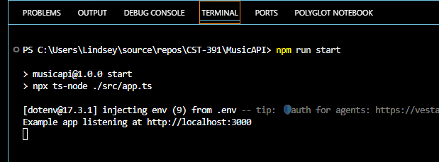
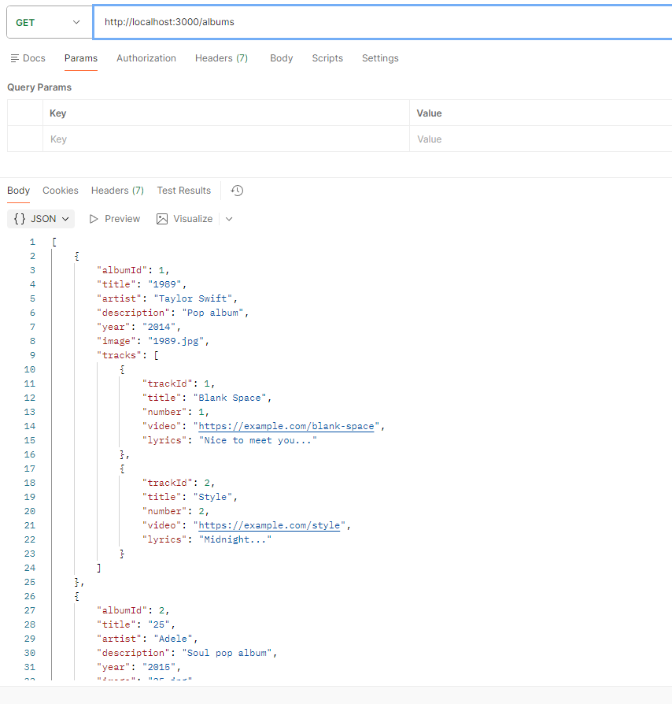
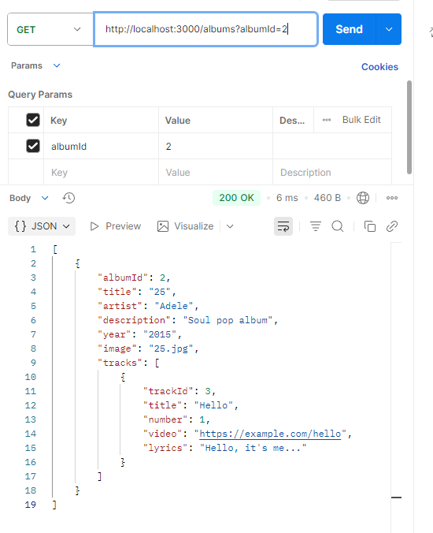
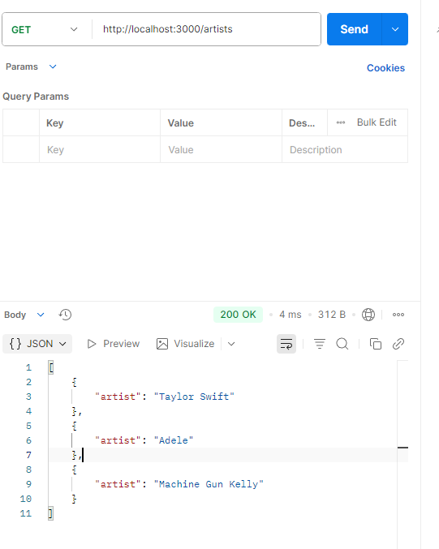
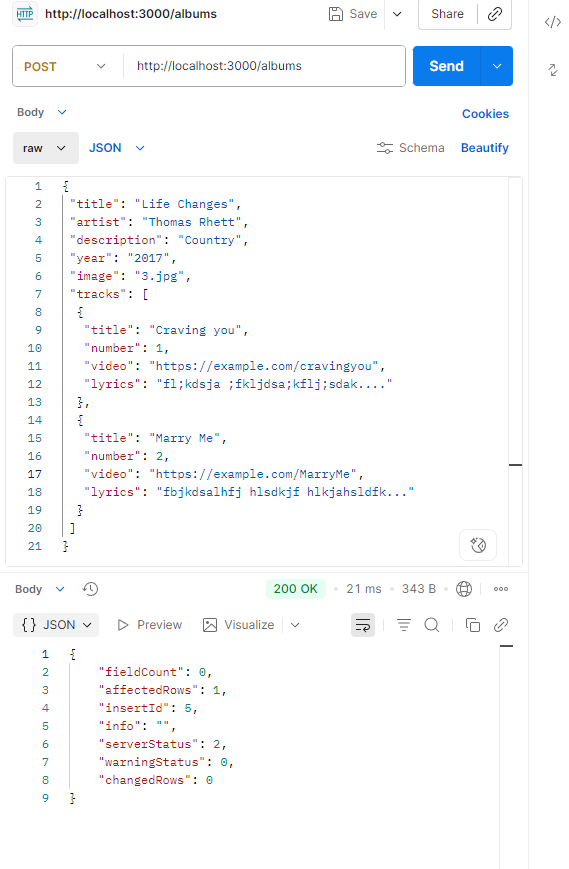
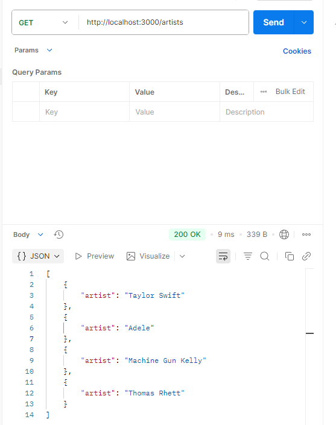
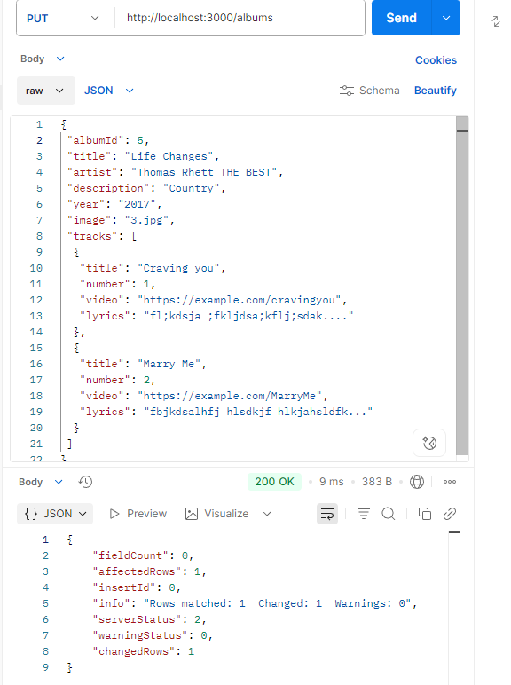
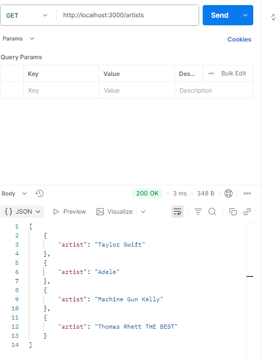

# CST391 - Activity 1: Express API - 
# Lindsey DeDecker
### March 16th, 2026

## Video Link
https://youtu.be/Hp9zqV5o9Rs

## Video Explanation
In the above video, I demonstrate the functionality of the MusicAPI app within the localhost and Postman.  We can see the API respond to many different requests. The project is fully functioning with retrieving, creating, updating and deleting albums and retrieving artist information. 

## Activity 1 - Introduction
In this activity, I built a RESTful API - MusicAPI - using Node.js, Express and TypeScript. The application followed MVC architecture with separate routers, controllers and DAOs organized by resource. I configured the build using package.json, tsconfig.json and nodemon. dotenv managed all environment variables which kept the database credentials out of the source code. Middleware was also used including a custom logger, CORS, and Helmet for security headers. Then I connected the API to a MySQL database using a connection pool to replace the hard-coded data with real queries.

## Screenshots

- ### Terminal Running with server connection working

- ### Postman GET All Albums
#### Below you can see that within Postman we can run a GET request and see all of the albums listed. 

- ### Postman GET Album by ID
#### Below you can see that within Postman we can run a GET request and retrieve a specific album using a query parameter for Album ID. 

- ### Postman GET Albums by Artist
#### Below you can see that within Postman we can run a GET request to retrieve all albums matching a specific artist.

- ### Postman Create New Album
#### Below you can see that within Postman we can run a POST request to create a new album.  Then you see a new list of artists that is updated to include the new artist 'Thomas Rhett' that was added with the POST request. 

- ### Postman Update Album
#### Below you can see that within Postman we can run a PUT request to make an update to an album. I updated the name of the artist - 'Thomas Rhett'.  Then we can see in the image below that his name was successfully updated.

## Explanation of one API Method
The Albums endpoint that retrieves the album data involves the router, controller and DAO. 

**Router**
- The router defines the endpoint and determines which controller method should handle the request.  When a GET request to /albums comes in, the router is going to direct the request to the readAlbums controller method.

**Controller**
- The controller processes the request and determines what data should be returned.  It will check the query parameter which in this case is AlbumId.  If it gets a specific ID that exists it will return it and if not it will return nothing.

**Data Access Object**
- The DAO communicates with the MySQL database by executing the SQL queries. The queries are processed through a MySQL connection pool.

## Explanation of Express API Project
In this project, I created a RESTful API called MusicAPI using Node.js, Express and TypeScript. The purpose of the application is managing music data stored in MySQL. The API follows MVC architecture with separate routers, controllers, and DAOs for each resource. Middleware including logging, CORS, and Helmet is used to handle requests, allow cross-origin communication, and set security headers. Environment variables are stored within the .env file, which is where the database configuration and connection settings are managed.

## Conclusion
This activity gave me a better understanding of how a production-style Node.js API is structured. Building the MVC architecture by hand made it clear how requests flow from the router through the controller and into the DAO before hitting the database. I also gained a better understanding of why async/await and Promises are important. Without non-blocking I/O, the server would be tied up on every database query and unable to handle multiple users at once, which is a big problem.

## Research Questions
1. Consider current development trends used in building web applications. Present an example and explain how effective you find it.

    - I have noticed a trend of API-first design and working through this course has made me appreciate why it has become such a standard approach. The idea is that instead of building your frontend and backend as one tightly coupled system, you design the API first so that any client can consume the same data layer. I find this really effective because it forces a clean separation of concerns from the start. A good example is the MusicAPI we have been building. The Express backend works the same whether it is Postman, Angular or React making the request.

2. What do you think about web application security and concerns about confidentiality? How do you see this personally affecting you as the developer, as well as users and potentially global partners?

    - I believe that confidentiality and security are so important when it comes to being a moral person. Confidentiality is protecting the information that you are exposed to and not sharing that with anyone that should not know it, this is where security comes into affect. It is a little more black and white to understand this when you think of Doctors and Nurses. However, there are many other professions that will deal with this as well including programming. When it comes to creating applications that will be storing any information of an individual, it is our responsibility to ensure that this person is protected. That is where security and integrity come into play. When we are creating things we need to understand that these people are putting their trust in us and it is our responsibility to create structures that will protect them. Something that I have appreciated during my time at GCU is that this has been stressed to us as students from day one.