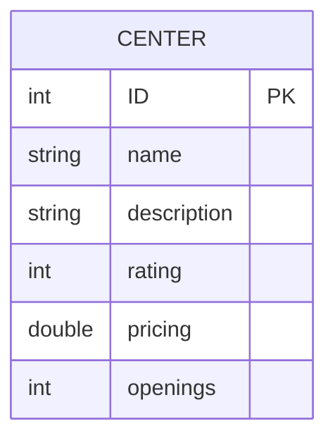
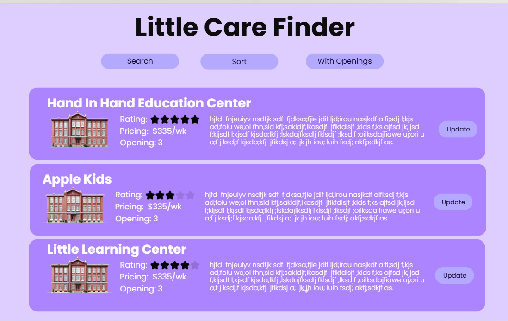
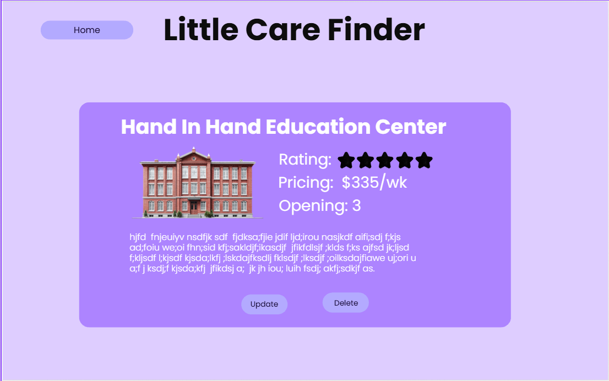
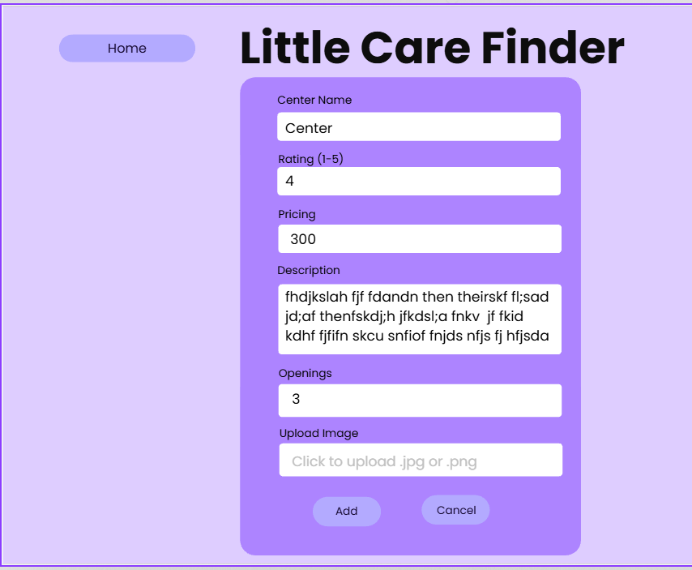
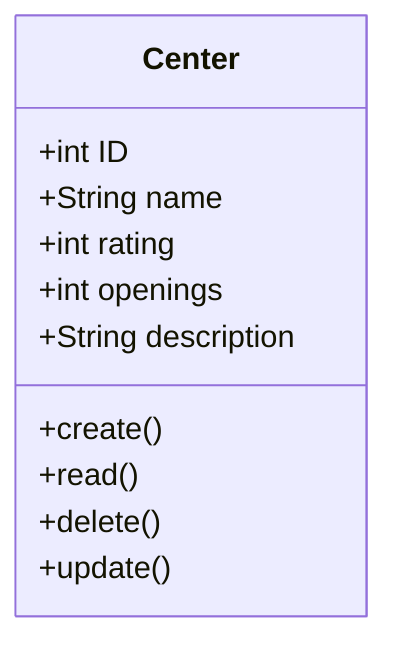

# CST391 - Milestone Project Proposal - 
# Lindsey DeDecker
# Little Care Finder
### March 8th, 2026

## Instructor Feedback
"Lindsey, WOW, NICE PRESENTATION.  You off to a great start and clearly defined your goal, Keep doing great, Bobby"

## Description of Application
Little Care Finer is a web application that parents can use to searh for quality childcare centers around them. 
- Users
    - Browse Childcare Center list
    - Sort childcare Centers
    - Search for Childcare Centers
- Admin
    - Add, delete and edit existing Childcare Centers

## Functional Requirements - User Stories

**Users**
- I want to ber able to see a list of all centers
- I want to be able to see the pricing and sort by pricing
- I want to be able to see their rating. I also want to be able to sort them by their rating
- I want to be able to filter to only see the centers that have an opeing
- I want to be able to search a center by the name or by details within their description. 

**Admin**
- I need to be able to add in a new Chidlcare Center
- I need to be able to remove them if they close
- I need to be able to edit all details of a childcare center to keep them up to date as things change. 

## Er Diagram

## UI SiteMap
### Home
- List of all Childcare Centers (cards)
- **Search Bar** - filter by keyword (name or description)
- **Sort/Filter controls**
    - Sort by rating (high to low)
    - Sort by Pricing (low to high)
    - Filter: Show only centers with openings
- **[+ Add Center]** button -> navigates to Add Page
- **[Manage Centers]** button -> navigates to Manage page
- Each center card links to a detail view 

---

### Manage Centers
- Full list of all Childcare Centers
- Each card has:
    - **[Update]** button -> navigates to Update page for that center
    - **[Delete]** button -> removes center with confirmation prompt
- **[+ Add Center]** button at top -> navigates to Add page

---

### Add center
- Form fields:
    - Name 
    - Description
    - Rating
    - PRicing 
    - Openings
- **[Submit]** button -> saves and returns to Manage page
- **[Cancel]** button -> returns to Manage page

---

### Update Center
- Pre-populates form wtih existing center's data
- Same fields as add center
- **[Save Changes]** button -> Updates and returns to Manage page
- **[Cancel]** button -> returns to manage page

## UI Wireframe

- ### Home Page
#### The home page is going to start by showing a list of all Chidcare Centers. Here the user can search, filter or show only avaliable with openings. The page view will not change, only the listing will update when these filters are used. There is also an update button to the right of each center to allow the user to update them. 

- ### Individual View
#### Here we can see larger the details for a specific center. We can also select to update or delete that center or go back to the home page. 

- ### Add and Update
#### This view will be the same for adding a new center or updating. For updating, the data weill preload.  All fields will be required and require specific information. There is also the ability to add an image of the center here as well to be displayed. 

## UML Class Diagram

## Risks
- Building two front-end versions of the same application will take extra time to learn and develop. 
- Kepping the Angular and React versions consistent may be challenging
- Designing search and sorting features will take additional time and testing
- Managing time is going to be important along the milestones and throughout this project.

## REST API Design
The Little Care Finder API will follow REST conventions . Resources will use plural nouns and actions will be handled using HTTP verbs such as GET, POST, PUT and DELETE
### Get ALL Centers
GET /api/centers

Returns a list of all chcildcare centers

### Get Center by ID
GET /api/centers/{id}

REturns the details for a specific childcare center.

### Create a New Center
POST /api/centers

Adds a new childcare center to the system.

### Update Center
PUT /api/centers/{id}

Updates an existing childcare center's infroamtion. 

### Delete Center
DELETE /api/centers/{id}

Removes a childcare center from the system.

